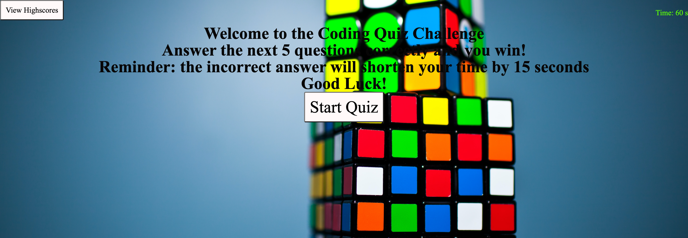

# Code Quiz Assignment
 Welcome to Code Quiz Assignment The goal of assignment was to create a code game, using HTML, CSS, and Javascript.

## Homework Criteria 
## User Story

```

AS A coding boot camp student
I WANT to take a timed quiz on JavaScript fundamentals that stores high scores
SO THAT I can gauge my progress compared to my peers

```
## Acceptance Criteria

```
GIVEN I am taking a code quiz
WHEN I click the start button
THEN a timer starts and I am presented with a question
WHEN I answer a question
THEN I am presented with another question
WHEN I answer a question incorrectly
THEN time is subtracted from the clock
WHEN all questions are answered or the timer reaches 0
THEN the game is over
WHEN the game is over
THEN I can save my initials and my score
```
## Description

- My motivation was to use my coding skills I learned in class in CSS, Javascript, and HTML.
- I researched how to stay organized in javascript.
- Also, create a visual reference of a well-adapted and creative code quiz.

## Table of Contents 

- [Installation](#installation)
- [Links](#links)
- [Credits](#credits)
- [Features](#features)


## Installation
VS Code

## Links

[The URL of the deployed application](https://kathylopez97.github.io/code-quiz/)

[The URL of the Github repository](https://github.com/kathylopez97/code-quiz)

## Mock-up

## Credits
-  https://www.youtube.com
-  https://www.w3schools.com


## Features
- CSS
- VS Code